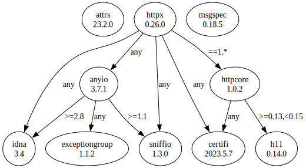

# Third Party Dependencies

<!--[[[fill sbom_sha256()]]]-->
The [SBOM in CycloneDX v1.4 JSON format](https://git.sr.ht/~sthagen/ajallaan/blob/default/sbom.json) with SHA256 checksum ([1ad9dd24 ...](https://git.sr.ht/~sthagen/ajallaan/blob/default/sbom.json.sha256 "sha256:1ad9dd24b6178dfbb16f33b21644daac5d9add170ff9bf9be30a0e7956bfbfaa")).
<!--[[[end]]] (checksum: c9cc95fa3b2899394508795bbb5dd47a)-->
## Licenses 

JSON files with complete license info of: [direct dependencies](direct-dependency-licenses.json) | [all dependencies](all-dependency-licenses.json)

### Direct Dependencies

<!--[[[fill direct_dependencies_table()]]]-->
| Name                                                           | Version                                            | License     | Author          | Description (from packaging data)                                                                        |
|:---------------------------------------------------------------|:---------------------------------------------------|:------------|:----------------|:---------------------------------------------------------------------------------------------------------|
| [attrs](https://www.attrs.org/)                                | [22.2.0](https://pypi.org/project/attrs/22.2.0/)   | MIT License | Hynek Schlawack | Classes Without Boilerplate                                                                              |
| [httpx](https://github.com/encode/httpx/blob/master/README.md) | [0.23.3](https://pypi.org/project/httpx/0.23.3/)   | BSD License | Tom Christie    | The next generation HTTP client.                                                                         |
| [msgspec](https://jcristharif.com/msgspec/)                    | [0.13.1](https://pypi.org/project/msgspec/0.13.1/) | BSD License | Jim Crist-Harif | A fast serialization and validation library, with builtin support for JSON, MessagePack, YAML, and TOML. |
<!--[[[end]]] (checksum: 9fc774ff974107c8fc40faf5ba4a021a)-->

### Indirect Dependencies

<!--[[[fill indirect_dependencies_table()]]]-->
| Name                                                               | Version                                                  | License                              | Author                 | Description (from packaging data)                                                   |
|:-------------------------------------------------------------------|:---------------------------------------------------------|:-------------------------------------|:-----------------------|:------------------------------------------------------------------------------------|
| [anyio](https://github.com/agronholm/anyio/blob/master/README.rst) | [3.6.2](https://pypi.org/project/anyio/3.6.2/)           | MIT License                          | Alex Grönholm          | High level compatibility layer for multiple asynchronous event loop implementations |
| [certifi](https://github.com/certifi/python-certifi)               | [2022.12.7](https://pypi.org/project/certifi/2022.12.7/) | Mozilla Public License 2.0 (MPL 2.0) | Kenneth Reitz          | Python package for providing Mozilla's CA Bundle.                                   |
| [h11](https://github.com/python-hyper/h11)                         | [0.14.0](https://pypi.org/project/h11/0.14.0/)           | MIT License                          | Nathaniel J. Smith     | A pure-Python, bring-your-own-I/O implementation of HTTP/1.1                        |
| [httpcore](https://github.com/encode/httpcore)                     | [0.16.3](https://pypi.org/project/httpcore/0.16.3/)      | BSD License                          | Tom Christie           | A minimal low-level HTTP client.                                                    |
| [idna](https://github.com/kjd/idna/blob/master/README.rst)         | [3.4](https://pypi.org/project/idna/3.4/)                | BSD License                          | Kim Davies             | Internationalized Domain Names in Applications (IDNA)                               |
| [rfc3986](http://rfc3986.readthedocs.io)                           | [1.5.0](https://pypi.org/project/rfc3986/1.5.0/)         | Apache Software License              | Ian Stapleton Cordasco | Validating URI References per RFC 3986                                              |
| [sniffio](https://github.com/python-trio/sniffio)                  | [1.3.0](https://pypi.org/project/sniffio/1.3.0/)         | Apache Software License; MIT License | Nathaniel J. Smith     | Sniff out which async library your code is running under                            |
<!--[[[end]]] (checksum: ab54b80bca6d1df39badc777b1a745d6)-->

## Dependency Tree(s)

JSON file with the complete package dependency tree info of: [the full dependency tree](package-dependency-tree.json)

### Rendered SVG

Base graphviz file in dot format: [Trees of the direct dependencies](package-dependency-tree.dot.txt)



### Console Representation

<!--[[[fill dependency_tree_console_text()]]]-->
````console
attrs==22.2.0
httpx==0.23.3
  - certifi [required: Any, installed: 2022.12.7]
  - httpcore [required: >=0.15.0,<0.17.0, installed: 0.16.3]
    - anyio [required: >=3.0,<5.0, installed: 3.6.2]
      - idna [required: >=2.8, installed: 3.4]
      - sniffio [required: >=1.1, installed: 1.3.0]
    - certifi [required: Any, installed: 2022.12.7]
    - h11 [required: >=0.13,<0.15, installed: 0.14.0]
    - sniffio [required: ==1.*, installed: 1.3.0]
  - rfc3986 [required: >=1.3,<2, installed: 1.5.0]
  - sniffio [required: Any, installed: 1.3.0]
msgspec==0.13.1
````
<!--[[[end]]] (checksum: 9f0cf70313cb514fc0793b8307ebe40d)-->
